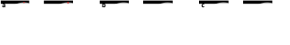

Background on Quantum Random Access Optimization: *Quantum relaxations, quantum random access codes, rounding schemes*
======================================================================================================================

This material provides a deeper look into the concepts behind Quantum
Random Access Optimization.

Relaxations
-----------

Consider a binary optimization problem defined on binary variables
:math:`m_i \in \{-1,1\}`. The choice of using :math:`\pm 1` variables
instead of :math:`0/1` variables is not important, but will be
convenient in terms of notation when we begin to re-cast this problem in
terms of quantum observables. We will be primarily interested in
`quadratic unconstrained binary optimization
(QUBO) <https://en.wikipedia.org/wiki/Quadratic_unconstrained_binary_optimization>`__
problems, although the ideas in this document can readily extend to
problems with more than quadratic terms, and problems with non-binary or
constrained variables can often be recast as a QUBO (though this
conversion will incur some overhead).

Within mathematical optimization,
`relaxation <https://en.wikipedia.org/wiki/Relaxation_%28approximation%29>`__
is the strategy of taking some hard problem and mapping it onto a
similar version of that problem which is (usually) easier to solve. The
core idea here is that for useful relaxations, the solution to the
relaxed problem can give information about the original problem and
allow one to heuristically find better solutions. An example of
relaxation could be something as simple as taking a discrete
optimization problem and allowing a solver to optimize the problem using
continuous variables. Once a solution is obtained for the relaxed
problem, the solver must find a strategy for extracting a discrete
solution from the relaxed solution of continuous values. This process of
mapping the relaxed solution back onto original problem’s set of
admissible solutions is often referred to as **rounding**.

For a concrete example of relaxation and rounding, see the
`Goemans-Williamson Algorithm for
MaxCut <https://en.wikipedia.org/wiki/Semidefinite_programming#Example_3_(Goemans%E2%80%93Williamson_max_cut_approximation_algorithm)>`__.

Without loss of generality, the rest of this document will consider a
`MaxCut <https://en.wikipedia.org/wiki/Maximum_cut>`__ objective
function defined on a graph :math:`G = (V,E)`. Our goal is to find a
partitioning of our vertices :math:`V` into two sets (:math:`+1` and
:math:`-1`), such that we maximize the number of edges which connect
both sets. More concretely, each :math:`v_i \in V` will be assigned a
binary variable :math:`m_i \in \{-1, 1\}`, and we will define the *cut*
of a variable assignment as:

.. math:: \text{cut}(m) = \sum_{ij; e_{ij} \in E} \frac{1}{2}(1-m_i m_j)

Quantum Relaxation
------------------

Our goal is to define a relaxation of our MaxCut objective function. We
will do this by mapping our objective function’s binary variables into
the space of single qubit Pauli observables and by embedding the set of
feasible inputs to cut(:math:`m`) onto the space of single-qubit quantum
product states. Let us denote this embedding :math:`F` as:

.. math::  F: \{-1,1\}^{M} \mapsto \mathcal{D}(\mathbb{C}^{2^n}),

.. math::  \text{cut}(m) \mapsto \text{Tr}\big(H\cdot F(m)\big),

where :math:`M = |V|`, and :math:`H` is a quantum Hamiltonian which
encodes our objective function.

For this to be `a valid
relaxation <https://en.wikipedia.org/wiki/Relaxation_%28approximation%29#Properties>`__
of our problem, it must be the case that:

.. math:: \text{cut}(m) \geq \text{Tr}\big(H\cdot F(m)\big)\qquad \forall m \in \{-1,1\}^M.

In order to guarantee this is true, we will enforce the stronger
condition that our relaxation **commutes** with our objective function.
In other words, cut(:math:`m`) is equal to the relaxed objective
function for all :math:`m \in \{-1,1\}^M`, rather than simply upper
bounding it. This detail will become crucially important further down
when we explicitly define our quantum relaxation.

A Simple Quantum Relaxation
---------------------------

Before explicating the full quantum relaxation scheme based on
single-qubit Quantum Random Access Codes (QRACs), it may be helpful to
first discuss `a version of quantum
optimization <https://github.com/Qiskit/qiskit-optimization/blob/main/docs/tutorials/06_examples_max_cut_and_tsp.ipynb>`__
which users may be more familiar with, but discussed in the language of
quantum relaxation and rounding.

Consider the embedding

.. math:: F^{(1)}: m \in \{-1,1\}^M \mapsto \{|0\rangle,|1\rangle\}^{\otimes M},

.. math:: \text{cut}(m) \mapsto \text{Tr}\big(H^{(1)}F^{(1)}(m)\big),\quad  H^{(1)} = \sum_{ij; e_{ij} \in E} \frac{1}{2}(1-Z_i Z_j),

where :math:`Z_i` indicates the single qubit Pauli-Z observable defined
on the :math:`i`\ ’th qubit and identity terms on all other qubits. It
is worth convincing yourself that this transformation is a valid
relaxation of our problem. In particular:

.. math:: \text{cut}(m) = \text{Tr}\big(H^{(1)}F^{(1)}(m)\big) \quad \forall m \in \{-1,1\}^M

This sort of embedding is currently used by many near-term quantum
optimization algorithms, including many `QAOA and VQE based
approaches <https://github.com/Qiskit/qiskit-optimization/blob/main/docs/tutorials/03_minimum_eigen_optimizer.ipynb>`__.
Observe how although the relaxed version of our problem can exactly
reproduce the objective function cut(:math:`m`) for inputs of the form
:math:`\{|0\rangle,|1\rangle\}^{\otimes M}`, we are also free to
evaluate :math:`H^{(1)}` using a continuous superposition of such
states. This stands in analogy to how one might classically relax an
optimization problem such that they optimize the objective function
using continuous values.

Crucially, a relaxation is only useful if there is some practical way to
**round** relaxed solutions back onto the original problem’s set of
admissible solutions. For this particular quantum relaxation, the
rounding scheme is simply given by measuring each qubit of our relaxed
solution in the :math:`Z`-basis. Measurement will project any quantum
state onto the set of computational basis states, and consequently, onto
the image of :math:`F^{(1)}`.

Quantum Relaxations via Quantum Random Access Codes (QRACs)
-----------------------------------------------------------

Quantum Random Access Codes were `first outlined in 1983 by Stephen
Wiesner
[2] <http://users.cms.caltech.edu/~vidick/teaching/120_qcrypto/wiesner.pdf>`__
and were used in the context of communication complexity theory. We will
not be using QRACs in the way they were originally conceived, instead we
are co-opting them to define our quantum relaxations. For this reason
will not provide a full introduction to RACs or QRACs, but encourage
interested readers to seek out more information about them.

:math:`(1,1,1)`, :math:`(2,1,p)`, and :math:`(3,1,p)` Quantum Random Access Codes
~~~~~~~~~~~~~~~~~~~~~~~~~~~~~~~~~~~~~~~~~~~~~~~~~~~~~~~~~~~~~~~~~~~~~~~~~~~~~~~~~

A :math:`(k,1,p)`-QRAC, is a scheme for embedding :math:`k` classical
bits into a 1-qubit state, such that given a single copy of this state,
you can recover any one of the :math:`k`-bits with probability :math:`p`
by performing some measurement. The simple quantum relaxation discussed
in the previous section is an example of a trivial :math:`(1,1,1)`-QRAC.
For convenience, we will write the :math:`(2,1,0.854)` and
:math:`(3,1,0.789)` QRACs as :math:`(2,1,p)` and :math:`(3,1,p)`,
respectively. It is worth noting :math:`(4, 1, p)`-QRAC :math:`(p > 1/2)`
has been `proven to be impossible.
[3] <https://iopscience.iop.org/article/10.1088/1367-2630/8/8/129>`__

As we generalize the simple example above, it will be helpful to write
out single qubit states decomposed in the Hermitian basis of Pauli
observables.

.. math:: \rho = \frac{1}{2}\left(I + aX + bY + cZ \right),\quad |a|^2 + |b|^2 + |c|^2 = 1

The embeddings :math:`F^{(1)}`, :math:`F^{(2)}`, and :math:`F^{(3)}`
associated respectively with the :math:`(1,1,1), (2,1,p),` and
:math:`(3,1,p)` QRACs can now be written as follows:

.. math::

   \begin{array}{l|ll} \text{QRAC} & &\text{Embedding into } \rho = \vert \psi(m)\rangle\langle\psi(m)\vert \\
   \hline
   (1,1,1)\qquad &F^{(1)}(m): \{-1,1\} &\mapsto\ \vert\psi^{(1)}_m\rangle \langle\psi^{(1)}_m\vert = \frac{1}{2}\Big(I + {m_0}Z \Big) \\
   (2,1,p)\qquad &F^{(2)}(m): \{-1,1\}^2 &\mapsto\ \vert\psi^{(2)}_m\rangle \langle\psi^{(2)}_m\vert = \frac{1}{2}\left(I + \frac{1}{\sqrt{2}}\big({m_0}X+ {m_1}Z \big)\right)  \\
   (3,1,p)\qquad &F^{(3)}(m): \{-1,1\}^3 &\mapsto\ \vert\psi^{(3)}_m\rangle \langle\psi^{(3)}_m\vert = \frac{1}{2}\left(I + \frac{1}{\sqrt{3}}\big({m_0}X+ {m_1}Y + {m_2}Z\big)\right) \\ \end{array}

.. math:: \text{Table 1: Explicit QRAC States}

Note that for when using a :math:`(k,1,p)`-QRAC with bit strings
:math:`m \in \{-1,1\}^M, M > k`, these embeddings scale naturally via
composition by tensor product.

.. math:: m \in \{-1,1\}^6,\quad F^{(3)}(m) = F^{(3)}(m_0,m_1,m_2)\otimes F^{(3)}(m_3,m_4,m_5)

Similarly, when :math:`k \nmid M`, we can simply pad our input bitstring
with the appropriate number of :math:`+1` values.

.. math:: m \in \{-1,1\}^4,\quad F^{(3)}(m) = F^{(3)}(m_0,m_1,m_2)\otimes F^{(3)}(m_3,+1,+1)

Recovering Encoded Bits
~~~~~~~~~~~~~~~~~~~~~~~

Given a QRAC state, we can recover the values of the encoded bits by
estimating the expectation value of each bit’s corresponding observable.
Note that there is a re-scaling factor which depends on the density of
the QRAC.

.. math::

   \begin{array}{ll|l|l}
   & \text{Embedding} &  m_0 = &  m_1 = &  m_2 =  &\
   \hline
    &\rho = F^{(1)}(m_0) &\text{Tr}\big(\rho Z\big) &  & \
    &\rho = F^{(2)}(m_0,m_1) &\sqrt{2}\cdot\text{Tr}\big(\rho X\big) &\sqrt{2}\cdot\text{Tr}\big(\rho Z\big) & \
    &\rho = F^{(3)}(m_0,m_1,m_2) & \sqrt{3}\cdot\text{Tr}\big(\rho X\big) & \sqrt{3}\cdot\text{Tr}\big(\rho Y\big) & \sqrt{3}\cdot\text{Tr}\big(\rho Z\big)
   \end{array}

.. math::  \text{Table 2: Bit recovery from QRAC States}

Encoded Problem Hamiltonians
~~~~~~~~~~~~~~~~~~~~~~~~~~~~

Using the tools we have outlined above, we can explicitly write out the
Hamiltonians which encode the relaxed versions of our MaxCut problem. We
do this by substituting each decision variable with the unique
observable that has been assigned to that variable under the embedding
:math:`F`.

.. math::

   \begin{array}{l|ll} \text{QRAC}  & \text{Problem Hamiltonian}\
   \hline
   (1,1,1)\qquad &H^{(1)} = \sum_{ij; e_{ij} \in E} \frac{1}{2}(1-Z_i Z_j)\\
   (2,1,p)\qquad &H^{(2)} = \sum_{ij; e_{ij} \in E} \frac{1}{2}(1-2\cdot P_{[i]} P_{[j]}),\quad P_{[i]} \in \{X,Z\}\\
   (3,1,p)\qquad &H^{(3)} = \sum_{ij; e_{ij} \in E} \frac{1}{2}(1-3\cdot P_{[i]} P_{[j]}),\quad P_{[i]} \in \{X,Y,Z\}\\ \end{array}

 

.. math::  \text{Table 3: Relaxed MaxCut Hamiltonians after QRAC Embedding}

Note that here, :math:`P_{[i]}` indicates a single-qubit Pauli
observable corresponding to decision variable :math:`i`. The bracketed
index here is to make clear that :math:`P_{[i]}` will not necessarily be
acting on qubit :math:`i`, because the :math:`(2,1,p)` and
:math:`(3,1,p)` no longer have a 1:1 relationship between qubits and
decision variables.

Commutation of Quantum Relaxation
~~~~~~~~~~~~~~~~~~~~~~~~~~~~~~~~~

Note that for the :math:`(2,1,p)` and :math:`(3,1,p)` QRACs, we are
associating multiple decision variables to each qubit. This means that
each decision variable is assigned a *unique* single-qubit Pauli
observable and some subsets of these Pauli observables will be defined
on the same qubits. This can potentially pose a problem when trying to
ensure the commutativity condition discussed earlier

Observe that under the :math:`(3,1,p)`-QRAC, any term in our objective
function of the form :math:`(1 - x_i x_j)` will map to a Hamiltonian
term of the form :math:`(1-3\cdot P_{[i]} P_{[j]})`. If both
:math:`P_{[i]}` and :math:`P_{[j]}` are acting on different qubits,
then :math:`P_{[i]}\cdot P_{[j]} = P_{[i]}\otimes P_{[j]}` and this term
of our Hamiltonian will behave as we expect.

If however, :math:`P_{[i]}` and :math:`P_{[j]}` are acting on the same
qubit, the two Paulis will compose directly. Recall that the Pauli
matrices form a group and are self-inverse, thus we can deduce that the
product of two distinct Paulis will yield another element of the group
and it will not be the identity.

Practically, this means that our commutation relationship will break and
:math:`\text{cut}(m) \not= \text{Tr}\big(H^{(1)}F^{(3)}(m)\big)`

In order to restore the commutation of our encoding with our objective
function, we must introduce an additional constraint on the form of our
problem Hamiltonian. Specifically, we must guarantee that decision
variables which share an edge in our input graph :math:`G` are not
assigned to the same qubit under our embedding :math:`F`

.. math:: \forall e_{ij} \in E,\quad F^{(3)}(\dots,m_i,\dots,m_j,\dots) = F^{(3)}(\dots,m_i,\dots)\otimes F^{(3)}(\dots,m_j,\dots)

In [1] this is accomplished by finding a coloring of the graph G such
that no vertices with the same color share an edge, and then assigning
variables to the same qubit only if they have the same color.

Quantum Rounding Schemes
------------------------

Because the final solution we obtain for the relaxed problem
:math:`\rho_\text{relax}` is unlikely to be in the image of :math:`F`,
we need a strategy for mapping :math:`\rho_\text{relax}` to the image of
:math:`F` so that we may extract a solution to our original problem.

In [1] there are two strategies proposed for rounding
:math:`\rho_\text{relax}` back to :math:`m \in \{-1,1\}^M`.

Semi-deterministic Rounding
~~~~~~~~~~~~~~~~~~~~~~~~~~~

A natural choice for extracting a solution is to use the results of
Table :math:`2` and simply estimate
:math:`\text{Tr}(P_{[i]}\rho_\text{relax})` for all :math:`i` in order
to assign a value to each variable :math:`m_i`. The procedure described
in Table :math:`2` was intended for use on states in the image of
:math:`F`, however, we are now applying it to arbitrary input states.
The practical consequence is we will no longer measure a value close to
{:math:`\pm 1`}, {:math:`\pm \sqrt{2}`}, or {:math:`\pm \sqrt{3}`}, as
we would expect for the :math:`(1,1,1)`, :math:`(2,1,p)`, and
:math:`(3,1,p)` QRACs, respectively.

We handle this by returning the sign of the expectation value, leading
to the following rounding scheme.

.. math::

   m_i = \left\{\begin{array}{rl}
         +1 & \text{Tr}(P_{[i]}\rho_\text{relax}) > 0 \\
         X \sim\{-1,1\} & \text{Tr}(P_{[i]}\rho_\text{relax}) = 0 \\
         -1 & \text{Tr}(P_{[i]}\rho_\text{relax}) < 0
         \end{array}\right.

Where :math:`X` is a random variable which returns either -1 or 1 with
equal probability.

Notice that semi-deterministic rounding will faithfully recover :math:`m`
from :math:`F(m)` with a failure probability that decreases
exponentially with the number of shots used to estimate each
:math:`\text{Tr}(P_{[i]}\rho_\text{relax})`

Magic State Rounding
~~~~~~~~~~~~~~~~~~~~

   Three different encodings, the states and the measurement bases, of variables into a
   single qubit. (a) One variable per qubit. (b) Two variables per qubit. (c) Three variables per
   qubit. Taken from `[1] <https://arxiv.org/pdf/2111.03167.pdf>`__.

Rather than seeking to independently distinguish each :math:`m_i`, magic
state rounding randomly selects a measurement basis which will perfectly
distinguish a particular pair of orthogonal QRAC states
:math:`\{ F(m), F(\bar m)\}`, where :math:`\bar m` indicates that
every bit of :math:`m` has been flipped.

Let :math:`\mathcal{M}` be the randomized rounding procedure which takes
as input a state :math:`\rho_\text{relax}` and samples a bitstring
:math:`m` by measuring in a randomly selected magic-basis.

.. math:: \mathcal{M}^{\otimes n}(\rho_\text{relax}) \rightarrow F(m)

First, notice that for the :math:`(1,1,1)`-QRAC, there is only one basis
to choose and the magic state rounding scheme is essentially equivalent
to the semi-deterministic rounding scheme.

For the :math:`(2,1,p)` and :math:`(3,1,p)` QRACs, if we apply the magic
state rounding scheme to an :math:`n`-qubit QRAC state :math:`F(m)`, we
will have a :math:`2^{-n}` and :math:`4^{-n}` probability of picking the
correct basis on each qubit to perfectly extract the solution :math:`m`.
Put differently, if we are given an unknown state :math:`F(m)` the
probability that :math:`\mathcal{M}^{\otimes n}(F(m))\mapsto F(m)`
decreases exponentially with the number of qubits measured - it is far
more likely to be mapped to some other :math:`F(m^*)`. Similarly, when
we perform magic rounding on an arbitrary state
:math:`\rho_\text{relax}`, we have similarly low odds of randomly
choosing the optimal magic basis for all :math:`n`-qubits. Fortunately
magic state rounding does offer a lower bound on the approximation ratio
under certain conditions.

Let :math:`F(m^*)` be the highest energy state in the image of F, and
let :math:`\rho^\*` be the maximal eigenstate of H.

.. math:: \forall \rho_\text{relax}\quad \text{st}\quad \text{Tr}\left(F(m^*)\cdot H\right) \leq \text{Tr}\left(\rho_\text{relax}\cdot H\right)\leq \text{Tr}\left(\rho^*\cdot H\right)

.. math:: \frac{\text{expected fval}}{\text{optimal fval}} = \frac{\mathbb{E}\left[\text{Tr}\left(H\cdot \mathcal{M}^{\otimes n}(\rho_\text{relax})\right)\right]}{\text{Tr}\left(H\cdot F(m^*)\right)} \geq \frac{5}{9}

References
----------

[1] Bryce Fuller et al., “Approximate solutions of combinatorial problems via quantum
relaxations,” (2021), `arXiv:2111.03167 <https://arxiv.org/pdf/2111.03167.pdf>`__,

[2] Stephen Wiesner, “Conjugate coding,” SIGACT News, vol. 15, issue 1,
pp. 78-88, 1983.
`link <http://users.cms.caltech.edu/~vidick/teaching/120_qcrypto/wiesner.pdf>`__

[3] Masahito Hayashi et al.,
“(4,1)-Quantum random access coding does not exist—one qubit is not enough to recover
one of four bits,” New Journal of Physics, vol. 8, number 8, pp. 129, 2006.
`link <https://iopscience.iop.org/article/10.1088/1367-2630/8/8/129>`__
